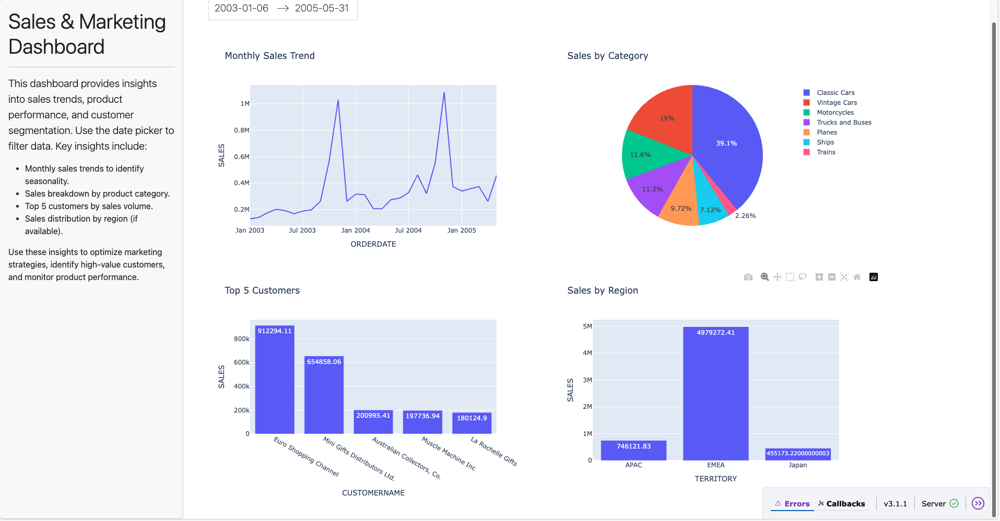

# AI Sales & Marketing Dashboard

This project is an interactive dashboard built using Dash to explore and analyze sales performance data.

## 🚀 Features

- 📈 Monthly sales trend (interactive line chart)
- 🥧 Category-based sales distribution (pie chart)
- 📆 Date filtering with a DatePickerRange
- ⚙️ Built with Dash, Plotly, Pandas

## 📊 Dataset

- Sample sales dataset from [Kaggle](https://www.kaggle.com/datasets/kyanyoga/sample-sales-data)

## 🛠 Tech Stack

- Python
- Dash (by Plotly)
- Pandas
- Scikit-learn (planned for future segmentation)
- Prophet (planned for future forecasting)

## 🧪 Run Locally

```bash
git clone git@github.com:YourUsername/ai-dashboard-sales-marketing.git
cd ai-dashboard-sales-marketing
conda create -n ai-dashboard python=3.10
conda activate ai-dashboard
pip install -r requirements.txt
python app.py
```

📸 Screenshots


# Sales and Marketing Dashboard

This interactive dashboard provides a comprehensive overview of sales and marketing performance, enabling data-driven decisions.

## Features

- **Date Range Filter:** Focus on specific periods to analyze trends.
- **Monthly Sales Trend:** Visualize sales over time to spot seasonality and growth.
- **Sales by Category:** Identify top-performing product lines.
- **Top 5 Customers:** Discover your most valuable customers.
- **Sales by Region:** Analyze geographic performance (if region data is available).

## Insights

- **Seasonality:** The monthly trend chart helps identify peak and low sales periods.
- **Product Performance:** The category pie chart reveals which product lines drive revenue.
- **Customer Segmentation:** The top customers bar chart highlights key accounts for targeted marketing.
- **Regional Analysis:** The region chart (if available) shows where your sales are strongest.

## How to Use

1. Select a date range using the picker.
2. Review the charts for actionable insights.
3. Use findings to optimize marketing campaigns, inventory, and customer engagement.

---

**Note:** For best results, ensure your data includes `ORDERDATE`, `SALES`, `PRODUCTLINE`, `CUSTOMERNAME`, and (optionally) `TERRITORY`.

📌 Author
Melvin Harsono – melvin555.github.io